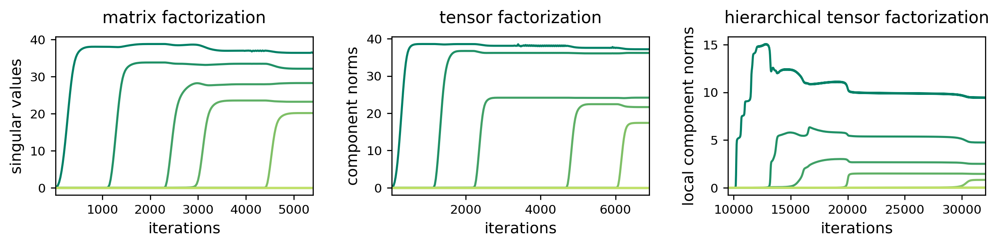
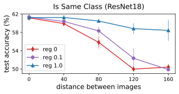
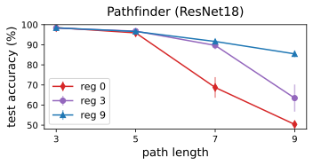

# Implicit Regularization in Hierarchical Tensor Factorization and Deep Convolutional Neural Networks.
Code, based on the PyTorch framework, for reproducing experiments from the paper Implicit Regularization in Hierarchical Tensor Factorization and Deep Convolutional Neural Networks.

## Install Requirements

Tested with python 3.8.

```
pip install -r requirements.txt
```

## 1. Incremental Hierarchical Tensor Rank Learning


### 1.1 Generating Data

#### Matrix Completion/Sensing
```
python matrix_factorization_data_generator.py --task_type completion
```
- Setting ```task_type``` to "sensing" will generate matrix sensing data.
- Use the ```-h``` flag for information on the customizable run arguments.

#### Tensor Completion/Sensing
```
python tensor_sensing_data_generator.py --task_type completion
```
- Setting ```task_type``` to "sensing" will generate tensor sensing data.
- Use the ```-h``` flag for information on the customizable run arguments.

### 1.2 Running Experiments

#### Matrix Factorization
```
python matrix_factorization_experiments_runner.py \
--dataset_path <path> \
--epochs 500000 \
--num_train_samples 2048 \
--outputs_dir "outputs/mf_exps" \
--save_logs \
--save_metric_plots \
--save_checkpoints \
--validate_every 25 \
--save_every_num_val 50 \
--epoch_log_interval 25 \
--train_batch_log_interval -1 
```

- ```dataset_path``` should point to the dataset file generated in the previous step.
- A folder with checkpoints, metric plots, and a log file will be automatically created under the directory specified by ```outputs_dir```.
- Use the ```-h``` flag for information on the customizable run arguments.
  
#### Tensor Factorization
```
python tensor_factorization_experiments_runner.py \
--dataset_path <path> \
--epochs 500000 \
--num_train_samples 2048 \
--outputs_dir "outputs/tf_exps" \
--save_logs \
--save_metric_plots \
--save_checkpoints \
--validate_every 25 \
--save_every_num_val 50 \
--epoch_log_interval 25 \
--train_batch_log_interval -1 
```

- ```dataset_path``` should point to the dataset file generated in the previous step.
- A folder with checkpoints, metric plots, and a log file will be automatically created under the directory specified by ```outputs_dir```.
- Use the ```-h``` flag for information on the customizable run arguments.
  
#### Hierarchical Tensor Factorization
```
python hierarchical_tensor_factorization_experiments_runner.py \
--dataset_path <path> \
--epochs 500000 \
--num_train_samples 2048 \
--outputs_dir "outputs/htf_exps" \
--save_logs \
--save_metric_plots \
--save_checkpoints \
--validate_every 25 \
--save_every_num_val 50 \
--epoch_log_interval 25 \
--train_batch_log_interval -1 
```

- ```dataset_path``` should point to the dataset file generated in the previous step.
- A folder with checkpoints, metric plots, and a log file will be automatically created under the directory specified by ```outputs_dir```.
- Use the ```-h``` flag for information on the customizable run arguments.
  


### 1.3 Plotting Results

Plotting metrics against the number of iterations for an experiment (or multiple experiments) can be done by:
```
python dynamical_analysis_results_multi_plotter.py \
--plot_config_path <path>
```
- ```plot_config_path``` should point to a file with the plot configuration. For example, ```plot_configs/mf_tf_htf_dyn_plot_config.json``` is the configuration used to create the plot below. To run it, it suffices to fill in the ```checkpoint_path``` fields (checkpoints are created during training inside the respective experiment's folder).

Example plot:

<p align="center">

</p>


## 2. Countering Locality Bias of Convolutional Networks via Regularization

### 2.1. Is Same Class

#### 2.1.1 Generating Data

Generating train data is done by running:

```
python is_same_class_data_generator.py --train --num_samples 5000
```
For test data use:
```
python is_same_class_data_generator.py --num_samples 10000
```

- Use the ```output_dir``` argument to set the output directory in which the datasets will be saved (default is ```./data/is_same```).
- The flag ```train``` determines whether to generate the dataset using the train or test set of the original dataset.
- Specify ```num_samples``` to set how many samples to generate.
- Use the ```-h``` flag for information on the customizable run arguments.

#### 2.1.2 Running Experiments
```
python is_same_class_experiments_runner.py \
--train_dataset_path <path> \
--test_dataset_path <path> \
--epochs 150 \
--outputs_dir "outputs/is_same_exps" \
--save_logs \
--save_metric_plots \
--save_checkpoints \
--validate_every 1 \
--save_every_num_val 1 \
--epoch_log_interval 1 \
--train_batch_log_interval 50 \
--stop_on_perfect_train_acc \
--stop_on_perfect_train_acc_patience 20 \
--model resnet18 \
--distance 0 \
--grad_change_reg_coeff 0
```

- `train_dataset_path` and `test_dataset_path` are the paths of the train and test dataset files, respectively.
- A folder with checkpoints, metric plots, and a log file will be automatically created under the directory specified by ```outputs_dir```.
- Use the ```-h``` flag for information on the customizable run arguments.

#### 2.1.3 Plotting Results

Plotting different regularization options against the task difficulty can be done by:

```
python locality_bias_plotter.py \
--experiments_dir <path> \
--experiment_groups_dir_names <group_1> <group_2> .. \
--per_experiment_group_y_axis_value_name <value_name_1> <value_name_2> .. \
--per_experiment_group_label <label_1> <label_2> .. \
--x_axis_value_name "distance" \
--plot_title "Is Same Class" \
--x_label "distance between images" \
--y_label "test accuracy (%)" \
--save_plot_to <path> \
--error_bars_opacity 0.5 
```

- Set `experiments_dir` to the directory containing the experiments you would like to plot.
- Specify after `experiment_groups_dir_names` the names of the experiment groups, each group name should
  correspond to a sub-directory with the group name under `experiments_dir` path.
- Use `per_experiment_group_y_axis_value_name` to name the report value for each experiment.
  Name should match key in experiment's `summary.json` files. Use dot notation for nested keys.
- `per_experiment_group_label` sets a label for the groups by the same order they were mentioned.
- `save_plot_to` is the path to save the plot at.
- Use `x_axis_value_name` to set the name of the value to use as the x-axis. This should match to a key in either
  `summary.json` or `config.json` files. Use dot notation for nested keys.
- Use the ```-h``` flag for information on the customizable run arguments.

Example plots:

<p align="center">
  
</p>

### 2.2. Pathfinder

#### 2.2.1 Generating Data

To generate Pathfinder datasets, first run the following command to create raw image samples for all specified path lengths:

```
python pathfinder_raw_images_generator.py \
--num_samples 20000 \
--path_lengths 3 5 7 9
```

- Use the ```output_dir``` argument to set the output directory in which the raw samples will be saved (default is ```./data/pathfinder/raw```).
- The samples for each path length are separated to different directories.
- Use the ```-h``` flag for information on the customizable run arguments.

Then, use the following command to create the dataset files for all path lengths (one dataset per length):
```
python pathfinder_data_generator.py \
--dataset_path data/pathfinder/raw \
--num_train_samples 10000 \
--num_test_samples 10000
```

- ```dataset_path``` is the path to the directory of the raw images.
- Use the ```output_dir``` argument to set the output directory in which the datasets will be saved (default is ```./data/pathfinder```).
- Use the ```-h``` flag for information on the customizable run arguments.

#### 2.2.2 Running Experiments
```
python pathfinder_experiments_runner.py \
--dataset_path <path> \
--epochs 150 \
--outputs_dir "outputs/pathfinder_exps" \
--save_logs \
--save_metric_plots \
--save_checkpoints \
--validate_every 1 \
--save_every_num_val 1 \
--epoch_log_interval 1 \
--train_batch_log_interval 50 \
--stop_on_perfect_train_acc \
--stop_on_perfect_train_acc_patience 20 \
--model resnet18 \
--grad_change_reg_coeff 0
```

- ```dataset_path``` should point to the dataset file generated in the previous step.
- A folder with checkpoints, metric plots, and a log file will be automatically created under the directory specified by ```outputs_dir```.
- Use the ```-h``` flag for information on the customizable run arguments.

#### 2.2.3 Plotting Results

Plotting different regularization options against the task difficulty can be done by:

```
python locality_bias_plotter.py \
--experiments_dir <path> \
--experiment_groups_dir_names <group_1> <group_2> .. \
--per_experiment_group_y_axis_value_name <value_name_1> <value_name_2> .. \
--per_experiment_group_label <label_1> <label_2> .. \
--x_axis_value_name "dataset_path" \
--plot_title "Pathfinder" \
--x_label "path length" \
--y_label "test accuracy (%)" \
--x_axis_ticks 3 5 7 9 \
--save_plot_to <path> \
--error_bars_opacity 0.5
```

- Set `experiments_dir` to the directory containing the experiments you would like to plot.
- Specify after `experiment_groups_dir_names` the names of the experiment groups, each group name should
  correspond to a sub-directory with the group name under `experiments_dir` path.
- Use `per_experiment_group_y_axis_value_name` to name the report value for each experiment.
  Name should match key in experiment's `summary.json` files. Use dot notation for nested keys.
- `per_experiment_group_label` sets a label for the groups by the same order they were mentioned.
- `save_plot_to` is the path to save the plot at.
- Use `x_axis_value_name` to set the name of the value to use as the x-axis. This should match to a key in either
  `summary.json` or `config.json` files. Use dot notation for nested keys.
- Use the ```-h``` flag for information on the customizable run arguments.

Example plots:

<p align="center">
  
</p>


## Citation

For citing the paper, you can use:

```
TBD
```